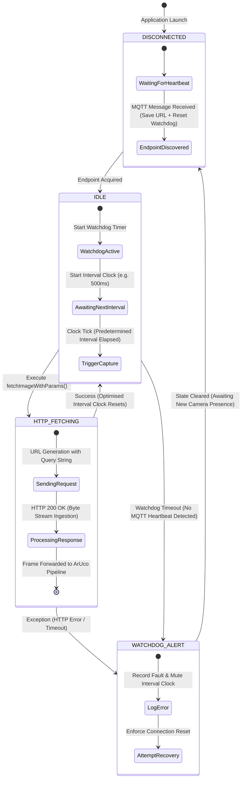

# State chart

```mermaid
stateDiagram-v2
    [*] --> DISCONNECTED: Application Launch

    state DISCONNECTED {
        [*] --> WaitingForHeartbeat
        WaitingForHeartbeat --> EndpointDiscovered: MQTT Message Received (Save URL + Reset Watchdog)
    }

    DISCONNECTED --> IDLE: Endpoint Acquired

    state IDLE {
        [*] --> WatchdogActive: Start Watchdog Timer
        WatchdogActive --> AwaitingNextInterval: Start Interval Clock (e.g. 500ms)
        AwaitingNextInterval --> TriggerCapture: Clock Tick (Predetermined Interval Elapsed)
    }

    IDLE --> HTTP_FETCHING: Execute fetchImageWithParams()

    state HTTP_FETCHING {
        [*] --> SendingRequest: URL Generation with Query String
        SendingRequest --> ProcessingResponse: HTTP 200 OK (Byte Stream Ingestion)
        ProcessingResponse --> [*]: Frame Forwarded to ArUco Pipeline
    }

    HTTP_FETCHING --> IDLE: Success (Optimised Interval Clock Resets)
    HTTP_FETCHING --> WATCHDOG_ALERT: Exception (HTTP Error / Timeout)
    IDLE --> WATCHDOG_ALERT: Watchdog Timeout (No MQTT Heartbeat Detected)

    state WATCHDOG_ALERT {
        [*] --> LogError: Record Fault & Mute Interval Clock
        LogError --> AttemptRecovery: Enforce Connection Reset
    }

    WATCHDOG_ALERT --> DISCONNECTED: State Cleared (Awaiting New Camera Presence)

```